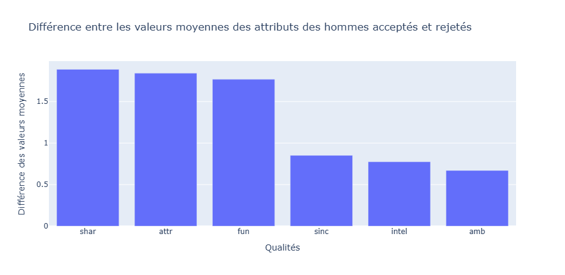
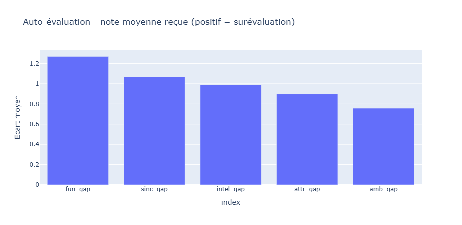

# Speed Dating Data Analysis

A comprehensive data science project analyzing a Speed Dating dataset to uncover what really drives romantic decisions.

## 📊 Project Overview

This project explores over 8,000 speed dating encounters to answer fundamental questions about human attraction and decision-making in romantic contexts. Using statistical analysis and machine learning, we challenge common assumptions about what people look for in potential partners.

## 🎯 Key Questions Explored

1. **What qualities do men and women actually seek in partners?**
   - Comparing stated preferences vs. actual behavior
   
2. **How important is physical attractiveness really?**
   - Analyzing the gap between perceived and real impact
   
3. **Shared interests vs. shared background: which matters more?**
   - Quantifying the role of shared attributes in matching
   
4. **Can people accurately assess their own dating market value?**
   - Measuring the gap between self-perception and reality
   
5. **Does the order of dates throughout the evening matter?**
   - Testing for fatigue effects in decision-making

## 🔍 Key Findings

### The "Stated vs. Revealed" Preference Paradox

**Women's preferences:**
- **Stated**: Intelligence and sincerity are most important
- **Reality**: Shared interests, attractiveness, and fun differentiate accepted from rejected partners



**Men's preferences:**
- **Stated**: Attractiveness dominates
- **Reality**: Attractiveness, shared interests, and fun are the key drivers (with attractiveness having notably stronger impact)


### The Attractiveness Myth

People believe attractiveness is **overwhelmingly** the most important factor (rated 2x higher than other attributes). While attractiveness is indeed the top factor, its real impact is more **moderate** compared to other qualities like shared interests and fun.

### Shared Interests vs. Shared Race

Using logistic regression with standardized coefficients:
- **Shared interests coefficient**: 0.9627 (highly significant, p < 0.001)
- **Same race coefficient**: 0.0165 (not significant, p = 0.754)

**Result**: Shared interests have ~58x more impact than racial background in predicting match acceptance.

### Self-Assessment Accuracy

On average, people **overestimate** their dating market value by approximately **1 point** (on a 10-point scale) across all attributes:
- Fun: +1.26 points
- Intelligence: +1.10 points  
- Attractiveness: +0.99 points
- Sincerity: +0.86 points
- Ambition: +0.75 points



### Date Order Effects

No significant difference between being the **first** date (42.9% acceptance) vs. the **last** date (39.0% acceptance) of the evening (p = 0.1458).

However, being the **1st date** shows significantly better outcomes than being the **10th date** (p = 0.0146), suggesting moderate fatigue effects.

## 🛠️ Technologies Used

- **Python 3.11**
- **Pandas** - Data manipulation and analysis
- **Plotly** - Visualizations
- **Scikit-learn** - Standardisation
- **Statsmodels** - Statistical testing
- **NumPy** - Numerical computing

## 📦 Installation

1. Clone this repository:
```bash
git clone https://github.com/JulienRouillard/speed-dating-analysis.git
cd speed-dating-analysis
```

2. Install required packages:
```bash
pip install -r requirements.txt
```

3. Launch Jupyter Notebook:
```bash
jupyter notebook
```

4. Open `speed_dating_analysis.ipynb`

## 📁 Project Structure

```
speed-dating-analysis/
│
├── speed_dating_analysis.ipynb    # Main analysis notebook
├── requirements.txt                # Python dependencies
├── README.md                       # Project documentation
│
├── data/
│   ├── Speed_Dating_Data.csv      # Dataset
│   └── Speed_Dating_Data_Key.doc  # Data dictionary
│
└── images/
    ├── diff_attributs_women.png   # Women's attribute differences visualization
    ├── diff_attributs_men.png     # Men's attribute differences visualization
    └── self_evaluation_vs_real.png # Self-assessment gap visualization
```

## 📊 Dataset

The dataset contains information from speed dating experiments, including:
- 8,378 speed dating encounters
- 551 participants
- Demographic information, preferences, and ratings across 6 attributes
- Match outcomes

**Attributes rated:**
- Attractiveness (`attr`)
- Sincerity (`sinc`)
- Intelligence (`intel`)
- Fun (`fun`)
- Ambition (`amb`)
- Shared interests (`shar`)

## 🔬 Methodology

1. **Exploratory Data Analysis**: Examining stated preferences and rating distributions
2. **Comparative Analysis**: Comparing attributes of accepted vs. rejected partners
3. **Statistical Modeling**: Logistic regression to quantify effect sizes
4. **Hypothesis Testing**: Z-tests for proportions to validate findings

## 💡 Insights for Real-World Applications

- **Dating apps**: Could benefit from better matching on interests rather than just demographics
- **Self-awareness**: People systematically overestimate their appeal, suggesting value in honest feedback
- **First impressions**: Attributes that are quickly observable (attractiveness, fun, shared interests) drive decisions more than deep qualities that require time to discover

## 📬 Contact

**Julien Rouillard**  
Email: julien.rouillard@yahoo.fr