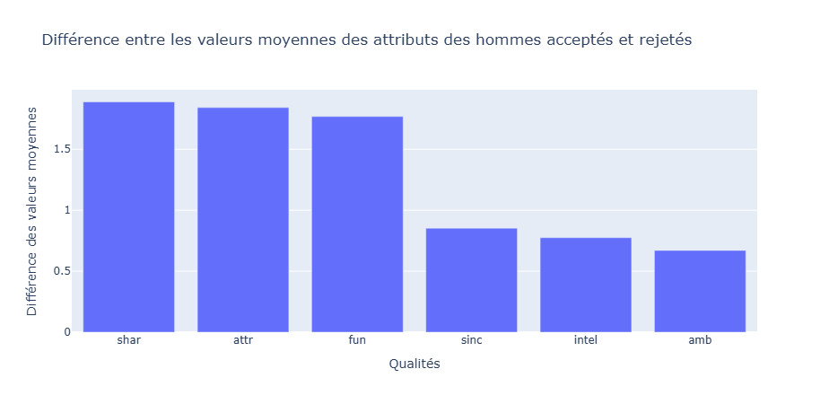
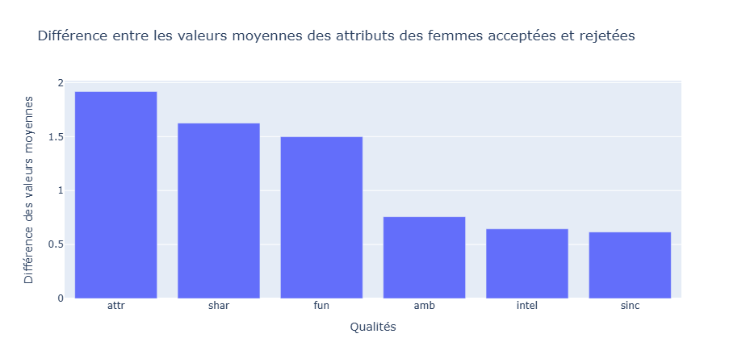
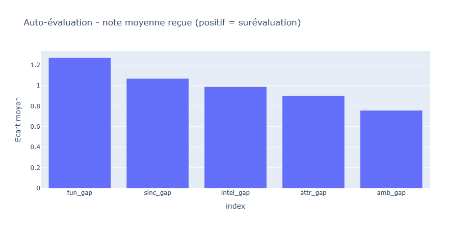

# Speed Dating Analysis: When Data Reveals What People Really Want


**8,378 speed dates. 551 participants. What really drives romantic attraction?**

This project analyzes behavioral data to understand romantic decision-making. I compare what people say they want versus what they actually choose. I also measure how demographic factors affect decisions and quantify self-perception biases. The results show clear gaps between what people think matters and what really predicts a match.

---

## 🎯 Core Business Question

Dating apps rely on user-declared preferences (filters, profile settings). But what if these declared preferences don't predict actual attraction? This analysis measures the gap between what people say they want and what they really respond to in face-to-face interactions.

---

## 📊 Key Findings

### 1. The Stated vs. Revealed Preference Paradox

**Women say they want:** Intelligence (21.0/100) and Sincerity (18.3/100)  
**Women actually choose based on:** Shared Interests, Attractiveness, and Fun (1.8+ point gap between accepted vs. rejected partners)

**Men say they want:** Attractiveness above all (27.0/100, 1.5x higher than other traits)  
**Men actually choose based on:** Attractiveness remains #1, but Shared Interests and Fun are almost as important (1.6-1.7 point gaps)

**Main insight:** What people declare as their priorities does not predict what drives their actual decisions. Shared interests are ranked last in stated preferences but are one of the strongest factors when accepting a second date.




---

### 2. Shared Interests Outweigh Shared Background

I used logistic regression with standardized coefficients to measure the effect of each factor:

- **Shared Interests coefficient:** 0.9627 (p < 0.001, highly significant)
- **Same Race coefficient:** 0.0165 (p = 0.754, not significant)

**What this means:** Shared interests have about **58x more impact** than racial similarity when predicting if someone will accept a second date. The confidence interval for same-race effect includes zero, which means we cannot even confirm it has any positive effect.

**Model Performance:** 67.9% accuracy vs. 56.7% baseline (random guessing) — this confirms that these features truly predict decisions.

---

### 3. Systematic Self-Perception Bias

People overestimate their dating market value by an average of **1.0 point** (on a 10-point scale) across all attributes:

- Fun: +1.27 points
- Sincerity: +1.07 points  
- Intelligence: +0.99 points
- Attractiveness: +0.90 points
- Ambition: +0.76 points

**Business impact:** Self-reported attractiveness data (commonly used in dating apps) is systematically inflated and cannot be trusted for matching algorithms.



---

## 🔬 Methodology

**Data Processing:**
- Cleaned 8,378 speed dating records (reduced 195 columns to focused subset)
- Handled missing values strategically (used dropna on key variables, kept 87% of data)
- Standardized continuous variables to enable coefficient comparison

**Statistical Approach:**
- **Comparative Analysis:** Calculated difference in means between accepted/rejected partners
- **Hypothesis Testing:** Used Z-tests for proportions to test order effects
- **Logistic Regression:** Isolated effect sizes using standardized predictors
- **Confidence Intervals:** Validated statistical significance at 95% confidence level

**Visualization Strategy:**
- Plotly for clear bar charts
- Focused on *differentials* (accepted - rejected) rather than raw scores to isolate decision factors

---

## 🛠️ Tech Stack

**Analysis & Statistics:**
- `pandas` — Data manipulation and aggregation
- `statsmodels` — Logistic regression, proportion tests, p-values
- `scipy.stats` — Statistical tests
- `sklearn.preprocessing.StandardScaler` — Feature standardization

**Visualization:**
- `plotly.express` — Charts

**Environment:** Python 3.10, Jupyter Notebook

---

## 📁 Project Structure

```
speed-dating-analysis/
│
├── speed_dating_project.ipynb    # Complete analysis workflow
├── README.md                      
│
├── data/
│   ├── Speed_Dating_Data.csv     # 8,378 encounters, 551 participants
│   └── Speed_Dating_Data_Key.doc # Variable codebook
│
└── images/
    ├── diff_attributs_women.png
    ├── diff_attributs_men.png
    └── self_evaluation_vs_real.png
```

---

## 💡 Business Applications

- **Matching Algorithms:** Give more weight to shared interests than to demographic filters (race, background). Shared interests predict compatibility 58x better.
- **User Profiling:** Don't rely on self-reported attractiveness ratings. Users overestimate their attractiveness by about 1 point on average.

---

## 📬 Contact

**Julien Rouillard**    
📧 julien.rouillard@yahoo.fr  
🔗 [GitHub](https://github.com/JulienRouillard) | [LinkedIn](https://www.linkedin.com/in/julien-rouillard)